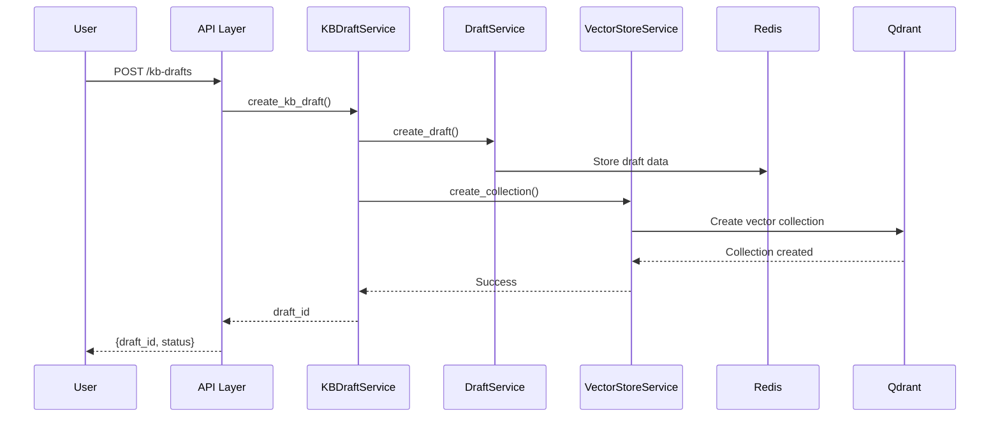
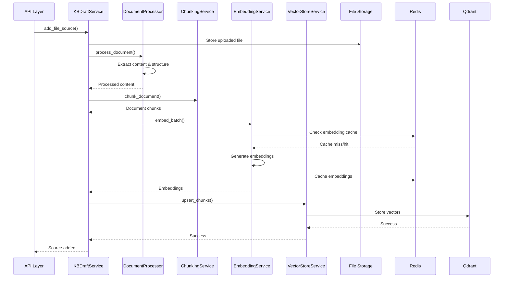
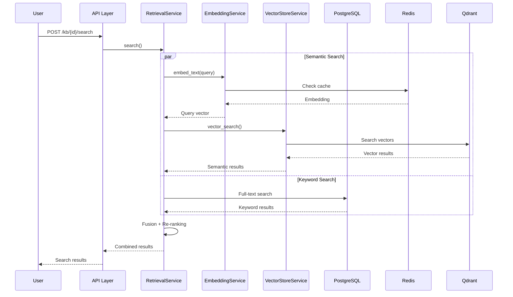
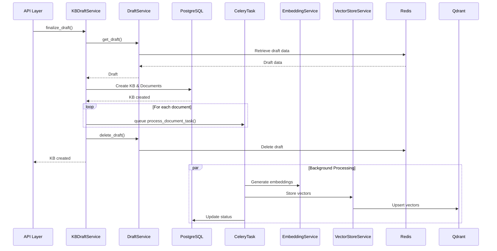

# 🏗️ KB Service Architecture & Communication Patterns

**Purpose**: Detailed documentation of service layer architecture, communication patterns, and data flow

**Target Audience**: Senior engineers and architects

**Status**: Production-ready patterns with proven scalability

---

## 📋 Table of Contents

1. [Service Layer Overview](#service-layer-overview)
2. [Service Communication Patterns](#service-communication-patterns)
3. [Data Flow Architecture](#data-flow-architecture)
4. [Error Handling & Resilience](#error-handling--resilience)
5. [Performance Optimization](#performance-optimization)
6. [Security Patterns](#security-patterns)
7. [Testing Strategies](#testing-strategies)

---

## Service Layer Overview

### Core Service Architecture

```
┌─────────────────┐    ┌─────────────────┐    ┌─────────────────┐
│   API Layer    │    │  Business Logic │    │ Infrastructure  │
│                │    │                 │    │                 │
│ • kb_draft.py  │───▶│ • kb_draft_     │───▶│ • Redis         │
│ • knowledge_   │    │   service       │    │ • PostgreSQL    │
│   bases.py     │    │ • document_     │    │ • Qdrant        │
│ • documents.py │    │   processing_   │    │ • Celery        │
│                │    │   service       │    │ • File Storage  │
│                │    │ • embedding_    │    │                 │
│                │    │   service       │    │                 │
│                │    │ • vector_store_ │    │                 │
│                │    │   service       │    │                 │
│                │    │ • retrieval_    │    │                 │
│                │    │   service       │    │                 │
└─────────────────┘    └─────────────────┘    └─────────────────┘
```

### Service Responsibility Matrix

| Service | Responsibility | Dependencies | Storage |
|---------|---------------|--------------|---------|
| **KBDraftService** | Draft lifecycle management | draft_service, document_processor | Redis |
| **DocumentProcessingService** | Parse & extract content | unstructured.io, PyMuPDF | File system |
| **ChunkingService** | Text segmentation | tiktoken | None |
| **EmbeddingService** | Vector generation | sentence-transformers | Redis (cache) |
| **VectorStoreService** | Vector CRUD operations | Qdrant client | Qdrant |
| **RetrievalService** | Search & ranking | vector_store, embedding | None |
| **TenantService** | Multi-tenancy enforcement | PostgreSQL | PostgreSQL |

---

## Service Communication Patterns

### 1. Synchronous Communication (Direct Calls)

**Pattern**: Service-to-service direct method calls for immediate operations

```python
# Example: KB Draft Creation Flow
class KBDraftService:
    async def create_kb_draft(self, workspace_id: UUID, name: str):
        # 1. Validate workspace access (sync)
        await tenant_service.verify_workspace_access(workspace_id, user_id)

        # 2. Create draft (sync)
        draft_id = draft_service.create_draft(...)

        # 3. Initialize vector collection (sync)
        await vector_store_service.create_collection(...)

        return draft_id
```

**When to Use**:
- Immediate validation required
- Atomic operations
- User-facing operations requiring fast response
- Data consistency requirements

### 2. Asynchronous Communication (Message Queue)

**Pattern**: Background processing via Celery tasks for heavy operations

```python
# Document Processing Pipeline
@celery.task(bind=True, autoretry_for=(Exception,), retry_kwargs={'max_retries': 3})
def process_document_task(self, document_id: str):
    """
    Background task for document processing.
    Implements retry logic and error handling.
    """
    try:
        # 1. Load document
        document = db.query(Document).filter(Document.id == document_id).first()

        # 2. Process content (heavy operation)
        content = await document_processor.process_document(document.file_path)

        # 3. Generate chunks
        chunks = await chunking_service.chunk_document(content)

        # 4. Generate embeddings (heavy operation)
        embeddings = await embedding_service.embed_batch([c.content for c in chunks])

        # 5. Store in vector database
        await vector_store_service.upsert_chunks(document.kb_id, chunks, embeddings)

        # 6. Update document status
        document.status = "completed"
        db.commit()

    except Exception as e:
        # Error handling with status update
        document.status = "error"
        document.error_message = str(e)
        db.commit()
        raise  # Re-raise for Celery retry mechanism
```

**When to Use**:
- Heavy computational operations
- Long-running processes
- Operations that can fail and need retry
- Batch processing

### 3. Event-Driven Communication

**Pattern**: Publisher-subscriber for loose coupling and scalability

```python
# Event System for KB Operations
class KBEventPublisher:
    """Publishes KB-related events for interested services."""

    def __init__(self):
        self.redis = redis.Redis()

    async def publish_kb_created(self, kb_id: UUID, metadata: Dict):
        """Notify services that a KB was created."""
        event = {
            "event_type": "kb_created",
            "kb_id": str(kb_id),
            "timestamp": datetime.utcnow().isoformat(),
            "metadata": metadata
        }

        # Publish to multiple channels
        self.redis.publish("kb_events", json.dumps(event))
        self.redis.publish(f"kb_events:{kb_id}", json.dumps(event))

    async def publish_document_processed(self, doc_id: UUID, kb_id: UUID):
        """Notify that document processing completed."""
        event = {
            "event_type": "document_processed",
            "document_id": str(doc_id),
            "kb_id": str(kb_id),
            "timestamp": datetime.utcnow().isoformat()
        }

        self.redis.publish("document_events", json.dumps(event))

# Event Subscriber Example
class AnalyticsService:
    """Subscribes to KB events for analytics tracking."""

    async def handle_kb_created(self, event: Dict):
        """Track KB creation metrics."""
        await self.record_metric("kb_created", {
            "kb_id": event["kb_id"],
            "timestamp": event["timestamp"]
        })

    async def handle_document_processed(self, event: Dict):
        """Track document processing metrics."""
        await self.record_metric("document_processed", {
            "document_id": event["document_id"],
            "kb_id": event["kb_id"]
        })
```

### 4. Circuit Breaker Pattern

**Pattern**: Prevent cascade failures when external services are unavailable

```python
import asyncio
from enum import Enum
from datetime import datetime, timedelta

class CircuitState(Enum):
    CLOSED = "closed"      # Normal operation
    OPEN = "open"          # Service unavailable
    HALF_OPEN = "half_open"  # Testing recovery

class CircuitBreaker:
    """Circuit breaker for external service calls."""

    def __init__(self, failure_threshold=5, recovery_timeout=60, success_threshold=3):
        self.failure_threshold = failure_threshold
        self.recovery_timeout = recovery_timeout
        self.success_threshold = success_threshold

        self.failure_count = 0
        self.success_count = 0
        self.last_failure_time = None
        self.state = CircuitState.CLOSED

    async def call(self, func, *args, **kwargs):
        """Execute function with circuit breaker protection."""

        if self.state == CircuitState.OPEN:
            if self._should_attempt_reset():
                self.state = CircuitState.HALF_OPEN
            else:
                raise CircuitBreakerOpenError("Service unavailable")

        try:
            result = await func(*args, **kwargs)
            self._on_success()
            return result

        except Exception as e:
            self._on_failure()
            raise

    def _should_attempt_reset(self):
        return (
            self.last_failure_time and
            datetime.now() - self.last_failure_time > timedelta(seconds=self.recovery_timeout)
        )

    def _on_success(self):
        self.failure_count = 0

        if self.state == CircuitState.HALF_OPEN:
            self.success_count += 1
            if self.success_count >= self.success_threshold:
                self.state = CircuitState.CLOSED
                self.success_count = 0

    def _on_failure(self):
        self.failure_count += 1
        self.last_failure_time = datetime.now()

        if self.failure_count >= self.failure_threshold:
            self.state = CircuitState.OPEN

# Usage with Vector Store Service
class ResilientVectorStoreService:
    def __init__(self):
        self.qdrant_client = QdrantClient()
        self.circuit_breaker = CircuitBreaker()

    async def search(self, kb_id: UUID, query_vector: List[float], **kwargs):
        try:
            return await self.circuit_breaker.call(
                self._search_internal, kb_id, query_vector, **kwargs
            )
        except CircuitBreakerOpenError:
            # Fallback to keyword search only
            logger.warning("Vector search unavailable, falling back to keyword search")
            return await self._keyword_search_fallback(kb_id, kwargs.get("query_text", ""))
```

---

## Data Flow Architecture

### 1. KB Creation Data Flow



### 2. Document Processing Data Flow



### 3. Search Data Flow



### 4. Draft Finalization Data Flow



---

## Error Handling & Resilience

### 1. Service-Level Error Handling

```python
class ServiceError(Exception):
    """Base service error."""
    pass

class ValidationError(ServiceError):
    """Input validation failed."""
    pass

class ExternalServiceError(ServiceError):
    """External service unavailable."""
    pass

class ResourceNotFoundError(ServiceError):
    """Requested resource not found."""
    pass

# Service Error Handler Decorator
def handle_service_errors(func):
    """Decorator for consistent service error handling."""

    async def wrapper(*args, **kwargs):
        try:
            return await func(*args, **kwargs)

        except ValidationError as e:
            logger.warning(f"Validation error in {func.__name__}: {e}")
            raise

        except ExternalServiceError as e:
            logger.error(f"External service error in {func.__name__}: {e}")
            # Could implement circuit breaker logic here
            raise

        except ResourceNotFoundError as e:
            logger.info(f"Resource not found in {func.__name__}: {e}")
            raise

        except Exception as e:
            logger.error(f"Unexpected error in {func.__name__}: {e}", exc_info=True)
            raise ServiceError(f"Internal service error: {str(e)}")

    return wrapper

# Usage Example
class DocumentProcessingService:
    @handle_service_errors
    async def process_document(self, file_path: str):
        if not Path(file_path).exists():
            raise ResourceNotFoundError(f"File not found: {file_path}")

        # Service logic here...
```

### 2. Retry Strategies

```python
import asyncio
import random
from functools import wraps

def retry_with_backoff(
    max_retries=3,
    base_delay=1.0,
    max_delay=60.0,
    exponential_base=2,
    jitter=True,
    retry_on=(Exception,)
):
    """Retry decorator with exponential backoff and jitter."""

    def decorator(func):
        @wraps(func)
        async def wrapper(*args, **kwargs):
            last_exception = None

            for attempt in range(max_retries + 1):
                try:
                    return await func(*args, **kwargs)

                except retry_on as e:
                    last_exception = e

                    if attempt == max_retries:
                        logger.error(f"Final retry failed for {func.__name__}: {e}")
                        raise

                    # Calculate delay with exponential backoff
                    delay = min(
                        base_delay * (exponential_base ** attempt),
                        max_delay
                    )

                    # Add jitter to prevent thundering herd
                    if jitter:
                        delay *= (0.5 + random.random() * 0.5)

                    logger.warning(
                        f"Retry {attempt + 1}/{max_retries} for {func.__name__} "
                        f"after {delay:.2f}s delay: {e}"
                    )

                    await asyncio.sleep(delay)

            raise last_exception

        return wrapper
    return decorator

# Usage
class EmbeddingService:
    @retry_with_backoff(
        max_retries=3,
        retry_on=(ConnectionError, TimeoutError)
    )
    async def embed_text(self, text: str):
        # Embedding logic that might fail
        pass
```

### 3. Graceful Degradation

```python
class RetrievalService:
    """Search service with graceful degradation."""

    async def search(self, kb: KnowledgeBase, query: str, **kwargs):
        """
        Search with fallback strategies:
        1. Hybrid search (semantic + keyword)
        2. Semantic search only
        3. Keyword search only
        4. Cached results
        """

        try:
            # Try full hybrid search
            return await self._hybrid_search(kb, query, **kwargs)

        except VectorStoreUnavailableError:
            logger.warning("Vector store unavailable, trying semantic search only")

            try:
                return await self._semantic_search_only(kb, query, **kwargs)

            except EmbeddingServiceUnavailableError:
                logger.warning("Embedding service unavailable, trying keyword search")

                try:
                    return await self._keyword_search_only(kb, query, **kwargs)

                except DatabaseUnavailableError:
                    logger.error("All search methods failed, returning cached results")
                    return await self._get_cached_results(kb, query)

    async def _get_cached_results(self, kb: KnowledgeBase, query: str):
        """Return cached search results as last resort."""
        cache_key = f"search_cache:{kb.id}:{hashlib.md5(query.encode()).hexdigest()}"
        cached = await self.redis.get(cache_key)

        if cached:
            return json.loads(cached)

        # Return empty results if no cache available
        return {"results": [], "message": "Search temporarily unavailable"}
```

---

## Performance Optimization

### 1. Connection Pooling

```python
# Database Connection Pool
from sqlalchemy.pool import QueuePool

engine = create_engine(
    DATABASE_URL,
    poolclass=QueuePool,
    pool_size=20,          # Number of connections to maintain
    max_overflow=30,       # Additional connections when pool is full
    pool_pre_ping=True,    # Validate connections before use
    pool_recycle=3600,     # Recycle connections every hour
)

# Redis Connection Pool
import redis

redis_pool = redis.ConnectionPool(
    host=REDIS_HOST,
    port=REDIS_PORT,
    password=REDIS_PASSWORD,
    max_connections=50,
    retry_on_timeout=True,
    health_check_interval=30
)

redis_client = redis.Redis(connection_pool=redis_pool)

# Qdrant gRPC Connection Pool
from qdrant_client import QdrantClient

qdrant_client = QdrantClient(
    host=QDRANT_HOST,
    port=QDRANT_PORT,
    grpc_port=QDRANT_GRPC_PORT,
    prefer_grpc=True,
    timeout=30.0,
    # Connection pool managed internally
)
```

### 2. Caching Strategies

```python
class MultiLevelCacheService:
    """Multi-level caching with different TTL strategies."""

    def __init__(self):
        self.l1_cache = {}  # In-memory cache (LRU)
        self.l2_cache = redis_client  # Redis cache

    async def get(self, key: str, ttl_seconds: int = 3600):
        """Get from cache with fallback levels."""

        # L1 Cache (in-memory)
        if key in self.l1_cache:
            value, expiry = self.l1_cache[key]
            if datetime.now() < expiry:
                return value
            else:
                del self.l1_cache[key]

        # L2 Cache (Redis)
        redis_value = await self.l2_cache.get(key)
        if redis_value:
            value = json.loads(redis_value)

            # Populate L1 cache
            self.l1_cache[key] = (
                value,
                datetime.now() + timedelta(seconds=min(ttl_seconds, 300))  # Max 5min in L1
            )

            return value

        return None

    async def set(self, key: str, value: Any, ttl_seconds: int = 3600):
        """Set in both cache levels."""

        # L2 Cache (Redis) - longer TTL
        await self.l2_cache.setex(key, ttl_seconds, json.dumps(value))

        # L1 Cache (Memory) - shorter TTL
        l1_ttl = min(ttl_seconds, 300)  # Max 5 minutes in memory
        self.l1_cache[key] = (
            value,
            datetime.now() + timedelta(seconds=l1_ttl)
        )

# Cache Usage Patterns
class EmbeddingService:
    def __init__(self):
        self.cache = MultiLevelCacheService()

    async def embed_text(self, text: str, model: str):
        cache_key = f"embedding:{model}:{hashlib.sha256(text.encode()).hexdigest()}"

        # Try cache first
        cached = await self.cache.get(cache_key, ttl_seconds=30*24*3600)  # 30 days
        if cached:
            return cached

        # Generate embedding
        embedding = await self._generate_embedding(text, model)

        # Cache result
        await self.cache.set(cache_key, embedding, ttl_seconds=30*24*3600)

        return embedding
```

### 3. Batch Processing Optimization

```python
class BatchProcessor:
    """Optimized batch processing for embeddings and vector operations."""

    def __init__(self, batch_size=32, max_workers=4):
        self.batch_size = batch_size
        self.max_workers = max_workers
        self.semaphore = asyncio.Semaphore(max_workers)

    async def process_embeddings_batch(self, texts: List[str], model: str):
        """Process embeddings in optimized batches."""

        if len(texts) <= self.batch_size:
            return await self._process_single_batch(texts, model)

        # Split into batches and process concurrently
        batches = [
            texts[i:i + self.batch_size]
            for i in range(0, len(texts), self.batch_size)
        ]

        tasks = [
            self._process_batch_with_semaphore(batch, model)
            for batch in batches
        ]

        batch_results = await asyncio.gather(*tasks)

        # Flatten results
        all_embeddings = []
        for batch_result in batch_results:
            all_embeddings.extend(batch_result)

        return all_embeddings

    async def _process_batch_with_semaphore(self, batch: List[str], model: str):
        async with self.semaphore:
            return await self._process_single_batch(batch, model)

    async def _process_single_batch(self, texts: List[str], model: str):
        # Actual embedding generation
        return await embedding_service.embed_batch(texts, model)
```

---

## Security Patterns

### 1. Tenant Isolation Enforcement

```python
class TenantSecurityService:
    """Enforces tenant isolation across all operations."""

    @staticmethod
    async def verify_resource_access(
        user_id: UUID,
        resource_id: UUID,
        resource_type: str,
        required_permission: str,
        db: Session
    ):
        """
        Verify user has permission to access resource within their tenant context.
        """

        # Get user's current tenant context from JWT
        jwt_payload = get_current_jwt_payload()
        user_org_id = jwt_payload.get("org_id")
        user_workspace_id = jwt_payload.get("ws_id")

        if resource_type == "knowledge_base":
            # Verify KB belongs to user's workspace
            kb = db.query(KnowledgeBase).filter(
                KnowledgeBase.id == resource_id,
                KnowledgeBase.workspace_id == user_workspace_id,
                KnowledgeBase.organization_id == user_org_id
            ).first()

            if not kb:
                raise ForbiddenError("Knowledge base not found or access denied")

        elif resource_type == "document":
            # Verify document belongs to KB in user's workspace
            doc = db.query(Document).join(KnowledgeBase).filter(
                Document.id == resource_id,
                KnowledgeBase.workspace_id == user_workspace_id,
                KnowledgeBase.organization_id == user_org_id
            ).first()

            if not doc:
                raise ForbiddenError("Document not found or access denied")

        # Check specific permission
        user_permissions = jwt_payload.get("perms", {})
        if not user_permissions.get(required_permission, False):
            raise ForbiddenError(f"Permission denied: {required_permission}")

        return True

# Usage in API endpoints
@router.get("/kb/{kb_id}/documents")
async def get_documents(
    kb_id: UUID,
    db: Session = Depends(get_db),
    current_user: User = Depends(get_current_user)
):
    # Verify access before proceeding
    await TenantSecurityService.verify_resource_access(
        user_id=current_user.id,
        resource_id=kb_id,
        resource_type="knowledge_base",
        required_permission="kb:read",
        db=db
    )

    # Safe to proceed with business logic
    documents = db.query(Document).filter(
        Document.knowledge_base_id == kb_id
    ).all()

    return documents
```

### 2. Input Validation & Sanitization

```python
from pydantic import BaseModel, validator, Field
import bleach
import re

class SecureKBRequest(BaseModel):
    """Secure input validation for KB requests."""

    name: str = Field(..., min_length=1, max_length=255)
    description: Optional[str] = Field(None, max_length=2000)

    @validator('name')
    def validate_name(cls, v):
        """Sanitize and validate KB name."""
        # Remove any HTML/script tags
        sanitized = bleach.clean(v, tags=[], strip=True)

        # Check for valid characters (alphanumeric, spaces, hyphens, underscores)
        if not re.match(r'^[a-zA-Z0-9\s\-_]+$', sanitized):
            raise ValueError('Name contains invalid characters')

        return sanitized.strip()

    @validator('description')
    def validate_description(cls, v):
        """Sanitize description."""
        if v is None:
            return None

        # Allow basic formatting but remove dangerous tags
        allowed_tags = ['p', 'br', 'strong', 'em', 'ul', 'ol', 'li']
        sanitized = bleach.clean(v, tags=allowed_tags, strip=True)

        return sanitized

class FileUploadValidator:
    """Secure file upload validation."""

    ALLOWED_EXTENSIONS = {'.pdf', '.docx', '.txt', '.md', '.csv'}
    MAX_FILE_SIZE = 50 * 1024 * 1024  # 50MB

    @classmethod
    def validate_file(cls, file: UploadFile) -> bool:
        """Validate uploaded file security."""

        # Check file extension
        file_ext = Path(file.filename).suffix.lower()
        if file_ext not in cls.ALLOWED_EXTENSIONS:
            raise ValidationError(f"File type {file_ext} not allowed")

        # Check file size
        if file.size > cls.MAX_FILE_SIZE:
            raise ValidationError(f"File size exceeds {cls.MAX_FILE_SIZE} bytes")

        # Check MIME type matches extension
        expected_types = {
            '.pdf': 'application/pdf',
            '.docx': 'application/vnd.openxmlformats-officedocument.wordprocessingml.document',
            '.txt': 'text/plain',
            '.md': 'text/markdown',
            '.csv': 'text/csv'
        }

        expected_mime = expected_types.get(file_ext)
        if expected_mime and file.content_type != expected_mime:
            raise ValidationError(f"MIME type mismatch for {file_ext}")

        return True
```

### 3. Audit Logging

```python
class AuditLogger:
    """Comprehensive audit logging for security compliance."""

    def __init__(self):
        self.logger = logging.getLogger("audit")

    async def log_kb_operation(
        self,
        operation: str,
        kb_id: Optional[UUID],
        user_id: UUID,
        organization_id: UUID,
        workspace_id: UUID,
        details: Dict = None,
        success: bool = True,
        error_message: str = None
    ):
        """Log KB-related operations."""

        audit_record = {
            "timestamp": datetime.utcnow().isoformat(),
            "event_type": "kb_operation",
            "operation": operation,
            "resource_type": "knowledge_base",
            "resource_id": str(kb_id) if kb_id else None,
            "user_id": str(user_id),
            "organization_id": str(organization_id),
            "workspace_id": str(workspace_id),
            "ip_address": self._get_client_ip(),
            "user_agent": self._get_user_agent(),
            "success": success,
            "error_message": error_message,
            "details": details or {}
        }

        # Log to file and/or external service
        self.logger.info(json.dumps(audit_record))

        # Store in database for compliance
        await self._store_audit_record(audit_record)

    async def log_search_operation(
        self,
        kb_id: UUID,
        query: str,
        results_count: int,
        user_id: UUID,
        organization_id: UUID,
        workspace_id: UUID
    ):
        """Log search operations for analysis."""

        # Hash query for privacy
        query_hash = hashlib.sha256(query.encode()).hexdigest()

        audit_record = {
            "timestamp": datetime.utcnow().isoformat(),
            "event_type": "search_operation",
            "resource_type": "knowledge_base",
            "resource_id": str(kb_id),
            "user_id": str(user_id),
            "organization_id": str(organization_id),
            "workspace_id": str(workspace_id),
            "query_hash": query_hash,
            "results_count": results_count,
            "ip_address": self._get_client_ip()
        }

        self.logger.info(json.dumps(audit_record))

# Usage in services
class KBDraftService:
    def __init__(self):
        self.audit_logger = AuditLogger()

    async def create_kb_draft(self, workspace_id: UUID, created_by: UUID, name: str):
        try:
            draft_id = await self._create_draft_internal(workspace_id, created_by, name)

            # Log successful operation
            await self.audit_logger.log_kb_operation(
                operation="create_draft",
                kb_id=None,
                user_id=created_by,
                organization_id=get_current_org_id(),
                workspace_id=workspace_id,
                details={"draft_id": draft_id, "name": name},
                success=True
            )

            return draft_id

        except Exception as e:
            # Log failed operation
            await self.audit_logger.log_kb_operation(
                operation="create_draft",
                kb_id=None,
                user_id=created_by,
                organization_id=get_current_org_id(),
                workspace_id=workspace_id,
                details={"name": name},
                success=False,
                error_message=str(e)
            )
            raise
```

---

## Testing Strategies

### 1. Service Unit Testing

```python
import pytest
from unittest.mock import AsyncMock, MagicMock
from app.services.kb_draft_service import KBDraftService

class TestKBDraftService:
    """Unit tests for KB Draft Service."""

    @pytest.fixture
    def kb_draft_service(self):
        service = KBDraftService()
        # Mock dependencies
        service.draft_service = AsyncMock()
        service.document_processor = AsyncMock()
        service.vector_store_service = AsyncMock()
        return service

    @pytest.mark.asyncio
    async def test_create_kb_draft_success(self, kb_draft_service):
        """Test successful KB draft creation."""

        # Setup mocks
        kb_draft_service.draft_service.create_draft.return_value = "draft_123"
        kb_draft_service.vector_store_service.create_collection.return_value = True

        # Execute
        result = await kb_draft_service.create_kb_draft(
            workspace_id=UUID("12345678-1234-5678-9abc-123456789abc"),
            created_by=UUID("87654321-4321-8765-cba9-876543210987"),
            name="Test KB"
        )

        # Verify
        assert result == "draft_123"
        kb_draft_service.draft_service.create_draft.assert_called_once()
        kb_draft_service.vector_store_service.create_collection.assert_called_once()

    @pytest.mark.asyncio
    async def test_add_file_source_invalid_file(self, kb_draft_service):
        """Test file source addition with invalid file."""

        # Setup mock to raise exception
        kb_draft_service.document_processor.process_document.side_effect = FileNotFoundError()

        # Execute and verify exception
        with pytest.raises(FileNotFoundError):
            await kb_draft_service.add_file_source(
                draft_id="draft_123",
                file_path="/nonexistent/file.pdf",
                original_filename="test.pdf"
            )
```

### 2. Integration Testing

```python
import pytest
from fastapi.testclient import TestClient
from sqlalchemy import create_engine
from sqlalchemy.orm import sessionmaker
from app.main import app
from app.db.base import Base

class TestKBIntegration:
    """Integration tests for KB functionality."""

    @pytest.fixture(scope="session")
    def test_db(self):
        """Create test database."""
        engine = create_engine("sqlite:///./test.db")
        Base.metadata.create_all(bind=engine)
        TestingSessionLocal = sessionmaker(autocommit=False, autoflush=False, bind=engine)
        yield TestingSessionLocal
        Base.metadata.drop_all(bind=engine)

    @pytest.fixture
    def client(self, test_db):
        """Create test client with database dependency override."""

        def override_get_db():
            try:
                db = test_db()
                yield db
            finally:
                db.close()

        app.dependency_overrides[get_db] = override_get_db
        yield TestClient(app)
        app.dependency_overrides.clear()

    def test_kb_creation_flow(self, client):
        """Test complete KB creation flow."""

        # 1. Create KB draft
        response = client.post("/api/v1/kb-drafts/", json={
            "name": "Test Knowledge Base",
            "description": "Integration test KB",
            "workspace_id": "12345678-1234-5678-9abc-123456789abc"
        })
        assert response.status_code == 200
        draft_id = response.json()["draft_id"]

        # 2. Add text source
        response = client.post(f"/api/v1/kb-drafts/{draft_id}/sources/text", json={
            "title": "Test Document",
            "content": "This is test content for integration testing.",
            "metadata": {"category": "test"}
        })
        assert response.status_code == 200

        # 3. Preview chunks
        response = client.post(f"/api/v1/kb-drafts/{draft_id}/preview-chunks")
        assert response.status_code == 200
        preview = response.json()
        assert preview["total_chunks"] > 0

        # 4. Validate draft
        response = client.post(f"/api/v1/kb-drafts/{draft_id}/validate")
        assert response.status_code == 200
        assert response.json()["valid"] is True

        # 5. Finalize draft
        response = client.post(f"/api/v1/kb-drafts/{draft_id}/finalize")
        assert response.status_code == 200
        kb_id = response.json()["kb_id"]
        assert kb_id is not None
```

### 3. Performance Testing

```python
import asyncio
import time
from concurrent.futures import ThreadPoolExecutor

class TestKBPerformance:
    """Performance tests for KB operations."""

    @pytest.mark.asyncio
    async def test_concurrent_embedding_generation(self):
        """Test concurrent embedding generation performance."""

        texts = [f"Test text number {i}" for i in range(1000)]

        start_time = time.time()

        # Process in batches concurrently
        batch_size = 50
        batches = [texts[i:i+batch_size] for i in range(0, len(texts), batch_size)]

        tasks = [
            embedding_service.embed_batch(batch, "all-MiniLM-L6-v2")
            for batch in batches
        ]

        results = await asyncio.gather(*tasks)

        end_time = time.time()
        processing_time = end_time - start_time

        # Verify performance (should process 1000 texts in under 30 seconds)
        assert processing_time < 30
        assert len(results) == len(batches)

        # Calculate throughput
        throughput = len(texts) / processing_time
        print(f"Embedding throughput: {throughput:.2f} texts/second")

    @pytest.mark.asyncio
    async def test_vector_search_latency(self):
        """Test vector search latency under load."""

        # Setup test data
        kb_id = UUID("12345678-1234-5678-9abc-123456789abc")
        query_vector = [0.1] * 384  # Mock embedding

        # Measure search latency
        latencies = []

        for _ in range(100):
            start_time = time.time()

            results = await vector_store_service.search(
                kb_id=kb_id,
                query_vector=query_vector,
                limit=10
            )

            latency = (time.time() - start_time) * 1000  # Convert to milliseconds
            latencies.append(latency)

        # Verify performance requirements
        avg_latency = sum(latencies) / len(latencies)
        p95_latency = sorted(latencies)[95]  # 95th percentile

        assert avg_latency < 50   # Average under 50ms
        assert p95_latency < 100  # 95th percentile under 100ms

        print(f"Average search latency: {avg_latency:.2f}ms")
        print(f"95th percentile latency: {p95_latency:.2f}ms")
```

This comprehensive service architecture guide provides the detailed patterns and practices needed to build a production-ready, scalable, and secure knowledge base system. The documented patterns ensure consistent implementation across all services while maintaining high performance and reliability standards.