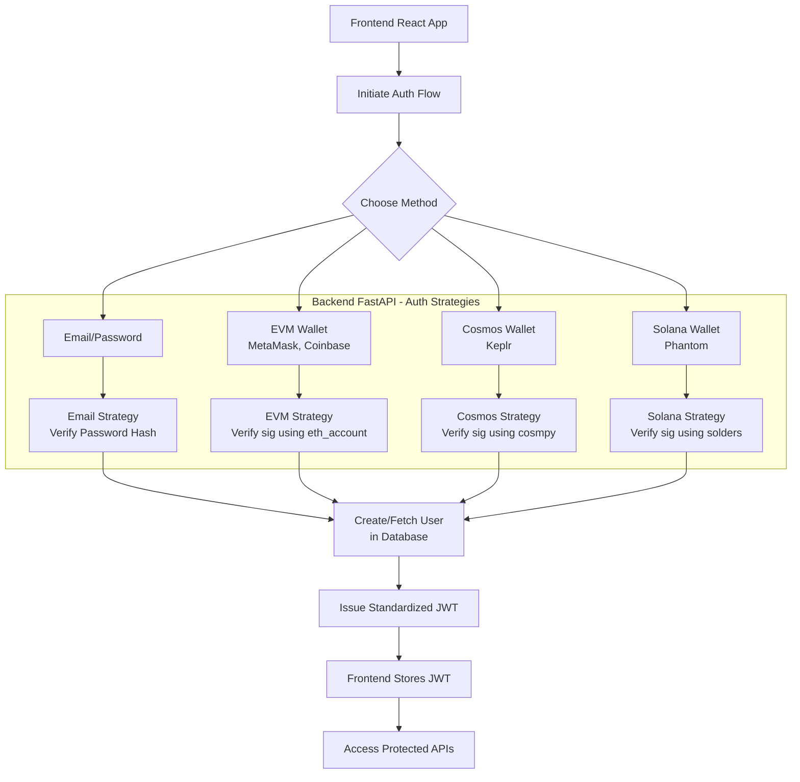

# 🤖 PrivexBot

**Privacy-First AI Chatbot Builder Powered by Secret Network**

[](https://secretnetwork.org/)
[](https://secretnetwork.org/)
[](https://en.wikipedia.org/wiki/Trusted_execution_environment)

---

## 📌 Overview

**PrivexBot** is a revolutionary privacy-focused, no-code AI chatbot builder that empowers businesses to deploy custom chatbots trained on their own data while maintaining strict data confidentiality. Unlike traditional platforms, all AI workloads—including training, inference, and data ingestion—are executed within **Secret Network's Trusted Execution Environments (TEEs)** using **Secret VMs**, ensuring **confidential computation**, **compliance**, and **zero data leakage**.

### 🎯 Core Value Proposition

- **🔐 Privacy-First**: All AI processing happens in encrypted memory environments (TEE)
- **🚫 Zero Data Leakage**: Your sensitive data never leaves the secure computation environment
- **⚡ No-Code Solution**: Build sophisticated chatbots without programming
- **🌐 Multi-Platform**: Deploy across websites, Discord, Telegram, WhatsApp, Slack, and more
- **📊 Enterprise-Ready**: SOC 2 Type II, GDPR and HIPAA compliant for healthcare, finance, and legal industries

---

## 🚀 Key Features

### 🤖 Dual Chatbot Creation Modes

#### **Simple Chatbot** (Form-Based Creation)

- Quick setup with form-based configuration
- Perfect for FAQ bots and knowledge retrieval
- Simple deployment and configuration
- Ideal for straightforward conversational AI needs

#### **Advanced Chatflow** (Visual Drag-and-Drop)

- Sophisticated drag-and-drop visual workflow builder
- Node-based logic with conditional branches, loops, and variables
- Advanced memory capabilities to track user conversations
- Live testing and preview functionality
- Complex multi-step process automation
- Built with ReactFlow for professional workflow design

### 🧠 Intelligent Knowledge Management

- **Multi-Format Support**: TXT, DOCX, PDF, HTML, CSV, Excel, Markdown, JSONL
- **Web Integration**: Import from websites, Google Docs, Notion pages, spreadsheets
- **Smart Chunking**: Advanced document processing with multiple chunking strategies
- **Real-Time Updates**: Instantly incorporate new information into your chatbots
- **Metadata Organization**: Advanced tagging and categorization system

### 🔒 Privacy & Security

- **Secret VM Integration**: All processing in Trusted Execution Environments
- **End-to-End Confidentiality**: Data encrypted during compute
- **Remote Attestation**: Cryptographic proof of tamper-free execution
- **Zero Trust Architecture**: Complete data sovereignty
- **Compliance Ready**: SOC 2 Type II, GDPR, HIPAA, and enterprise security standards

### 🌍 Deployment & Integration

**Multi-Channel Deployment:**

- Website embed widgets
- Custom domain hosting
- Discord, Telegram, Slack, WhatsApp
- API endpoints for custom integrations

**Automation & Integrations:**

- Zapier workflows
- Google Calendar/Drive/Docs
- Gmail automation
- Calendly scheduling
- Twilio communications
- Custom API connections

---

## 💼 Use Cases

### 🏥 Healthcare (HIPAA-Compliant)

- **Patient FAQ Assistant**: Secure, automated patient inquiry responses
- **Policy Guidance**: Navigate health policies and procedures safely
- **Appointment Scheduling**: HIPAA-compliant booking system

### 🏢 Enterprise Internal Tools

- **Employee Onboarding**: HR policy and procedure automation
- **Internal Documentation**: Secure access to SOPs and company knowledge
- **IT Support**: Automated technical support with private data protection

### 💰 Customer Support & Sales

- **Website Support Bot**: Product documentation and FAQ automation
- **Lead Qualification**: Intelligent lead capture and routing
- **Sales Automation**: CRM integration with Zapier workflows

### 🎓 Education & Training

- **Course Assistant**: Educational content delivery and Q&A
- **Training Programs**: Automated training material navigation
- **Student Support**: 24/7 academic assistance

---

Database Schema: The Foundation of Multi-Tenancy

Your schema needs to model users, their identities, and the tenant hierarchy.

```sql
-- Core User Identity (Independent of Tenancy)
CREATE TABLE users (
    id UUID PRIMARY KEY,
    username VARCHAR(255) UNIQUE,
    is_active BOOLEAN DEFAULT TRUE,
    created_at TIMESTAMPTZ DEFAULT NOW()
);

-- How a User Authenticates
CREATE TABLE auth_identities (
    id UUID PRIMARY KEY,
    user_id UUID REFERENCES users(id) ON DELETE CASCADE,
    provider VARCHAR(50), -- 'email', 'evm', 'cosmos', 'solana'
    provider_id VARCHAR(255), -- email address or wallet address
    data JSONB, -- password hash, nonce, etc.
    UNIQUE(provider, provider_id)
);

-- The Top-Level Tenant (e.g., "Acme Corp")
CREATE TABLE organizations (
    id UUID PRIMARY KEY,
    name VARCHAR(255) NOT NULL,
    created_by UUID REFERENCES users(id),
    created_at TIMESTAMPTZ DEFAULT NOW()
);

-- A subdivision within an Org (e.g., "Engineering", "Marketing")
CREATE TABLE workspaces (
    id UUID PRIMARY KEY,
    name VARCHAR(255) NOT NULL,
    organization_id UUID REFERENCES organizations(id) ON DELETE CASCADE,
    created_by UUID REFERENCES users(id),
    created_at TIMESTAMPTZ DEFAULT NOW()
);

-- User-to-Organization Membership (with Role)
CREATE TABLE organization_members (
    id UUID PRIMARY KEY,
    user_id UUID REFERENCES users(id) ON DELETE CASCADE,
    organization_id UUID REFERENCES organizations(id) ON DELETE CASCADE,
    role VARCHAR(50) NOT NULL, -- 'owner', 'admin', 'member'
    created_at TIMESTAMPTZ DEFAULT NOW(),
    UNIQUE(user_id, organization_id)
);

-- User-to-Workspace Membership (optional, for granular control)
CREATE TABLE workspace_members (
    id UUID PRIMARY KEY,
    user_id UUID REFERENCES users(id) ON DELETE CASCADE,
    workspace_id UUID REFERENCES workspaces(id) ON DELETE CASCADE,
    role VARCHAR(50) NOT NULL,
    created_at TIMESTAMPTZ DEFAULT NOW(),
    UNIQUE(user_id, workspace_id)
);

-- All other resources (chatbots, knowledge bases, etc.) get tenant columns:
CREATE TABLE chatbots (
    id UUID PRIMARY KEY,
    name VARCHAR(255) NOT NULL,
    workspace_id UUID REFERENCES workspaces(id) ON DELETE CASCADE, -- Critical for isolation
    config JSONB,
    created_by UUID REFERENCES users(id),
    created_at TIMESTAMPTZ DEFAULT NOW()
);
```

### Authentication Flow (FastAPI Backend)

The auth flow remains largely the same as the previous excellent explanation, but the JWT payload now needs to be richer.

**JWT Payload Structure:**

```python
{
  "sub": "user_id", # Standard subject identifier
  "email": "user@example.com", # For convenience
  "org_id": "active_organization_id", # User's currently selected org
  "ws_id": "active_workspace_id",     # User's currently selected workspace
  "perms": { # A map of permissions for the active context
    "org:admin": true,
    "workspace:write": true,
    "chatbot:create": true
  }
}
```

**How to populate this?** After successful authentication, your backend must:

1.  Find the user's organizations.
2.  Determine a default organization/workspace (e.g., the first one they created or the last one they used).
3.  Calculate their permissions _for that specific org/workspace_ based on their `role` in the `organization_members` and `workspace_members` tables.
4.  Encode this information into the JWT.

**Critical Endpoints:**

- `POST /auth/session/switch-context`: Allows a user to switch their active organization/workspace. This would validate their membership and issue a new JWT with the updated `org_id`, `ws_id`, and `perms`.

### Authorization Layer (The Real Challenge)

This is where you enforce tenancy. Every single API endpoint that accesses data must be protected.

**Step 1: FastAPI Dependency for User Extraction**
This decodes the JWT and gets the user ID and context.

```python
async def get_current_active_user(token: str = Depends(oauth2_scheme)) -> User:
    # ... decode JWT, validate, return user object with embedded JWT payload data
```

**Step 2: FastAPI Dependency for Resource Access**
This is the crucial tenancy check. For example, an endpoint to get a chatbot by ID:

```python
async def get_chatbot(
    chatbot_id: UUID,
    current_user: User = Depends(get_current_active_user),
    db: Session = Depends(get_db)
) -> Chatbot:
    # The magic query: it joins the chatbot to its workspace and checks membership
    chatbot = db.query(Chatbot).join(Workspace).join(Organization).filter(
        Chatbot.id == chatbot_id,
        Organization.id == current_user.org_id, # From JWT
        # Optional: Check if user is member of the chatbot's workspace
        # Workspace.id.in_([ws.id for ws in current_user.workspaces])
    ).first()

    if not chatbot:
        raise HTTPException(status_code=404, detail="Chatbot not found")
    return chatbot
```

_This ensures a user can only ever access a chatbot that resides in their currently active organization._

### Frontend (React) Considerations

- **State Management:** Use a robust state manager like **Zustand** or **Redux** to manage the user's auth state, current organization/workspace, and permissions.
- **API Client:** Your HTTP client (e.g., axios) must automatically attach the JWT to every request.
- **UI Permissions:** Use the permissions from the JWT (or a dedicated `/me` endpoint) to show/hide UI elements (e.g., `{ user.perms['chatbot:create'] && <Button>Create Chatbot</Button> }`).
- **Tenancy Switching:** Build a dropdown in your UI to allow users to switch between their organizations/workspaces. This would call the `/auth/session/switch-context` endpoint to get a new JWT.

This authentication architecture is visualized in the following flow, showing how different authentication providers integrate into a unified system:



### Step-by-Step Implementation Guide

#### 1. Database Schema (The Foundation)

Use a relational schema that supports multiple identities per user. This is the most flexible approach.

**`users` table**
| Column | Type | Description |
| :--- | :--- | :--- |
| `id` | UUID (PK) | **Internal user ID.** This is the primary key referenced in your JWT and all app logic. |
| `username` | String | A unique, user-chosen name. |
| `is_active` | Boolean | If false, user cannot log in. |
| `created_at` | Timestamp | |

**`auth_identities` table**
| Column | Type | Description |
| :--- | :--- | :--- |
| `id` | UUID (PK) | |
| `user_id` | UUID (FK) | **Links to the `users` table.** |
| `provider` | String | The auth method: `email`, `evm`, `cosmos`, `solana`. |
| `provider_id` | String | The unique ID from that provider.<br>- `email`: The email address.<br>- `evm`: The wallet address (0x...).<br>- `cosmos`: The wallet address (cosmos1...).<br>- `solana`: The wallet address (base58...). |
| `data` | JSONB | Provider-specific data.<br>- `email`: Password hash, verification status.<br>- `wallets`: Last used nonce, public key. |

This model allows one user to log in with both an email and multiple wallets, all tied to the same account.

#### 2. Backend (FastAPI) Implementation

**Highly Recommended Library:** Use `FastAPI-Users` as your foundation. It provides a brilliant, modular base for user management (registration, login, password hashing, JWT generation). You extend it with custom "authentication transports" and "strategies" for your wallets.

**a) Email Auth (Using FastAPI-Users):**
This is handled out-of-the-box. It securely hashes passwords, handles verification emails, and login flows.

**b) Wallet Auth (Custom Strategy - The Challenge/Response Flow):**
This is the secure standard for Web3. The backend never handles private keys.

1.  **Request Challenge:** `GET /auth/{provider}/challenge?address={wallet_address}`

    - The backend generates a unique, time-limited **nonce** (a random string). Store this `nonce` in a fast cache (**Redis**, crucial for Docker) linked to the `address`.
    - Return a structured message for the user to sign. Best practice is to follow a standard like **EIP-4361 (Sign-In with Ethereum)** which includes the nonce, domain, and statement to prevent replay attacks. Example: `"Please sign this message to authenticate. Nonce: {nonce}"`.

2.  **Verify Signature:** `POST /auth/{provider}/verify`
    - The frontend sends: `{ "address": "0x...", "signed_message": "...", "signature": "0x..." }`.
    - Backend retrieves the expected `nonce` from Redis using the `address`.
    - **Use a chain-specific library to cryptographically verify** that the `signature` was generated by the `address` for the exact `signed_message`.
    - If valid, find or create a user in the DB. If the `provider_id` (wallet address) exists in `auth_identities`, get the `user_id`. If not, create a new `users` row and link it.
    - Invalidate the used nonce.
    - Call `FastAPI-Users`'s internal methods to generate a JWT for the user.

**Chain-Specific Verification Libraries:**

- **EVM (MetaMask, Coinbase):** `eth_account` (from `web3.py`). The standard is EIP-191/EIP-4361.
- **Cosmos (Keplr):** `cosmpy` or `cosmospy`. The standard is a common signing format for Cosmos-SDK chains.
- **Solana:** `solders` (modern) or `solana.py`. The standard uses the **Ed25519** curve.

#### Frontend (React) Implementation

- **State Management:** Use React Context or a state library (Zustand is great for this) to manage the user's auth state and JWT.
- **Wallet Connection:** Use standard wallet provider libraries:
  - **EVM:** `ethers.js` or `web3.js`.
  - **Cosmos:** `@cosmjs/sta` or wallet-specific kits.
  - **Solana:** `@solana/web3.js`.
- **Flow:**
  1.  User clicks "Connect Wallet".
  2.  Request accounts from the wallet.
  3.  Call your backend's `/auth/evm/challenge` endpoint with the address.
  4.  Prompt the user to sign the message string returned from the backend.
  5.  Send the signed message and signature to the `/auth/evm/verify` endpoint.
  6.  Receive the JWT and store it in memory. **For best security, use HTTP-only cookies (protected against XSS) if your frontend and backend are on the same domain.**
  7.  Use this JWT in the `Authorization: Bearer <JWT>` header for all API requests.

---

## 🏗️ CORE PROCESSING Architecture

### Processing Pipeline

1. **Data Ingestion**: Upload documents, websites, or connect external sources
2. **Intelligent Chunking**: Advanced text processing with configurable strategies
3. **Vector Embedding**: Semantic understanding within secure environment
4. **Secure Storage**: Encrypted knowledge base in Secret VM
5. **Query Processing**: Retrieval-augmented generation with source traceability
6. **Response Generation**: Contextualized answers from Secret AI LLM

---

## 🛠️ Getting Started

### Quick Setup (3 Steps)

1. **📄 Import Your Data**

   ```
   • Upload files (PDF, DOCX, TXT, etc.)
   • Connect websites or external sources
   • Configure chunking and processing settings
   ```

2. **🎨 Customize Your Bot**

   ```
   • Choose creation mode (Simple/Advanced)
   • Configure branding (name, avatar, tone)
   • Set up logic, memory, and workflows
   ```

3. **🚀 Deploy Everywhere**
   ```
   • Generate embed codes for websites
   • Connect to Discord, Slack, Telegram
   • Create custom domain deployments
   • Set up API integrations
   ```

### Advanced Configuration

**Knowledge Base Management:**

- Multiple chunking strategies (size-based, heading-based, topic-based)
- Metadata tagging and organization
- Real-time content updates
- External knowledge base connections

**Workflow Builder:**

- Drag-and-drop visual interface
- Conditional logic and branching
- Loop constructs and variables
- Integration with external APIs
- Live preview and testing

---

## 📚 Documentation

| Resource                                           | Description                                                  |
| -------------------------------------------------- | ------------------------------------------------------------ |
| [Knowledge Base Guide](./create-knowledge-base.md) | Complete guide to creating and managing knowledge bases      |
| [Chunking Strategies](./privexbot-chunking.md)     | Advanced document processing and chunking methods            |
| [Knowledge Management](./manage-knowledge-base.md) | API and web-based content management                         |
| [Website Import](./website-import.md)              | Import content from websites using Firecrawl and Jina Reader |
| [FAQ](./FAQ.md)                                    | Common questions and troubleshooting                         |
| [Technical Documentation](./privexbot-doc.md)      | Detailed technical specifications                            |

---

## 👥 Team

**Core Development Team:**

- **Harrison Eze** - Lead Software Engineer & AI Specialist (3+ years blockchain & AI experience)
- **Vera Ifebuche** - Frontend Developer (React & UI Logic specialist, 2+ years)
- **Paul Salawu** - UI/UX Researcher & Designer (2+ years user experience design)
- **Amarachi Cynthia Eze** - Product Designer & Market Researcher (3+ years product design)
- Achimi Dennis: UI/UX designer with a passion for creating seamless and impactful digital experiences.

_Experienced team with 2+ years collaboration on various projects_

---

## 🎯 Secret Network Integration

### Why Secret Network?

**PrivexBot** leverages Secret Network's cutting-edge privacy infrastructure:

- **Secret VMs**: Trusted Execution Environment for all AI processing
- **Confidential Computing**: End-to-end encryption during computation
- **Decentralized Infrastructure**: No single point of failure
- **Verifiable Privacy**: Cryptographic proofs of secure execution

### Privacy Benefits

- **Data Sovereignty**: Your data never leaves the secure environment
- **Compliance**: Meet enterprise security requirements (GDPR, HIPAA)
- **Audit Trail**: Complete traceability with source-backed responses
- **Zero Knowledge**: AI processing without exposing sensitive information

---

## 🚀 Development Status

**Grant Program**: Secret Network Grant Program: Privacy-as-a-Service  
**Development Timeline**: 6 months  
**Total Investment**: $30,000

### Roadmap Milestones

| Phase             | Duration    | Deliverables                                     | Status         |
| ----------------- | ----------- | ------------------------------------------------ | -------------- |
| UI/UX Design      | Weeks 1-4   | Complete Figma designs for builder and dashboard | 🔄 In Progress |
| RAG Pipeline      | Weeks 5-8   | Data ingestion, chunking, embeddings, indexing   | ⏳ Planned     |
| AI Core + Backend | Weeks 9-13  | Chatbot backend, memory, bot actions             | ⏳ Planned     |
| Frontend Builder  | Weeks 14-16 | No-code builder, drag-and-drop chatflow          | ⏳ Planned     |
| Integrations      | Weeks 17-22 | Zapier, Slack, Discord, Gmail, Calendly          | ⏳ Planned     |
| Launch & Growth   | Weeks 23-26 | 500+ users, 5K+ messages, 3+ integrations        | ⏳ Planned     |

---

## 🌟 Why Choose PrivexBot?

### Traditional Chatbot Builders vs PrivexBot

| Feature           | Traditional Builders             | PrivexBot                           |
| ----------------- | -------------------------------- | ----------------------------------- |
| **Privacy**       | ❌ Data exposed to third parties | ✅ End-to-end encryption in TEE     |
| **Compliance**    | ⚠️ Limited compliance options    | ✅ SOC 2 Type II, GDPR, HIPAA ready |
| **Data Control**  | ❌ Vendor lock-in                | ✅ Complete data sovereignty        |
| **Security**      | ⚠️ Standard cloud security       | ✅ Cryptographically secure         |
| **Customization** | ⚠️ Template-based limitations    | ✅ Advanced drag-and-drop workflows |
| **Verification**  | ❌ No execution verification     | ✅ Remote attestation proofs        |

---

## 🤝 Contributing

We welcome contributions from the community! This project represents the future of privacy-preserving AI applications.

### How to Get Involved

1. **Community Feedback**: Share your use cases and feature requests
2. **Beta Testing**: Join our beta program when available
3. **Technical Contributions**: Contribute to documentation and integrations
4. **Privacy Advocacy**: Help spread awareness about privacy-first AI

---

## 📞 Contact & Support

**Project**: [Privexbot](https://github.com/privexbot/privexbot)
**Email**: [privexbot@gmail.com](mailto:privexbot@gmail.com)

- **Project Lead**: Harrison Eze
- **GitHub**: [@harystyleseze](https://github.com/harystyleseze)
- **Supported By**: Secret Network — Privacy-as-a-Service Grant Initiative

---

## 📜 License & Compliance

**License**: Apache License
Privexbot is open-source and freely available under the [Apache License](https://opensource.org/license/apache-2-0). All privacy and compliance features are engineered to meet enterprise-grade security and data protection standards.

_PrivexBot: Where Privacy Meets Intelligence_ 🔐🤖

---

**Built by the PrivexBot Team | Powered by Secret Network**
